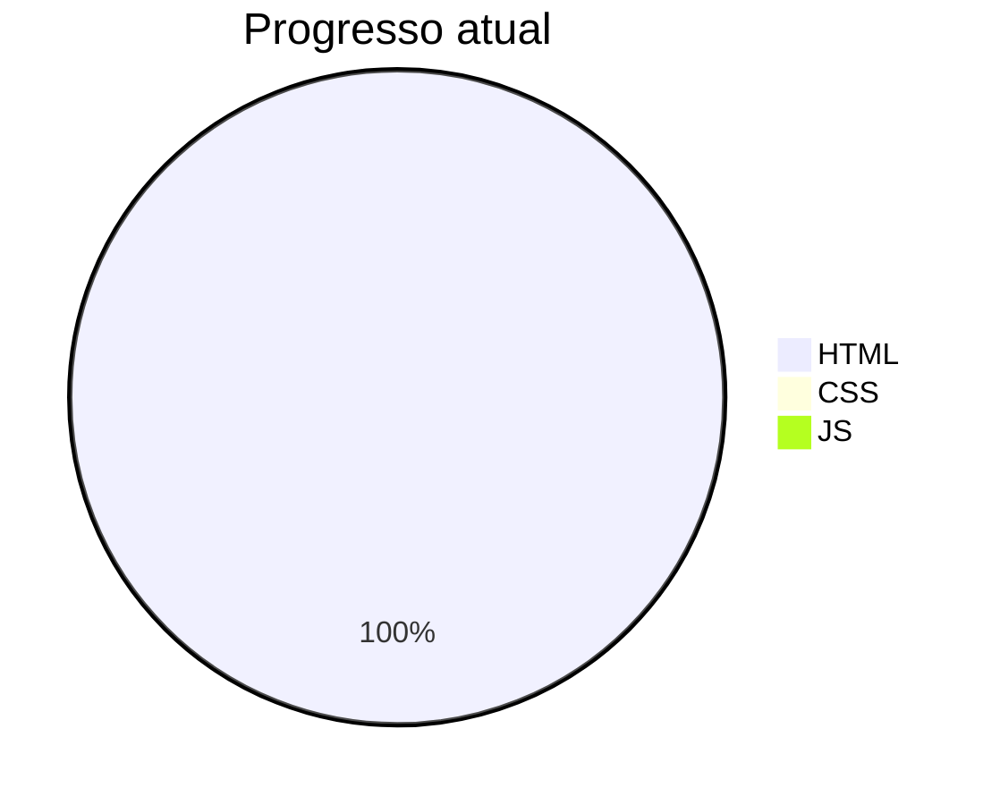

# SANTANDER 2025 FRONT-END - DIO (🚧 EM ANDAMENTO)

## 🎯 Objetivo

Documentar minha jornada de aprendizado no curso de Front-End da DIO, 
salvando todos os exercícios, anotações e projetos desenvolvidos durante as aulas.

## 📁 Estrutura

| Pastas    | Descrição                 | Status          |
|---------  |---------------------------|-----------------|
| `HTML`    | Primeiros passos com HTML | 🟢 Em andamento |
| `CSS`     | **Ainda não foi criado**  | ⏳ Aguardando   |
| `JS`      | **Ainda não foi criado**  | ⏳ Aguardando   |
| `Projects`| **Ainda não foi criado**  | ⏳ Aguardando   |

## 📊 Gráfico de Progresso

## 📈 HTML - Meu aprendizado (por enquanto)

### 🏁 Primeiros passos com HTML
- [x] Estrutura básica (DOCTYPE, html, head, body);
- [x] Títulos (h1 ao h6);
- [x] Parágrafos e formatação (p, strong, mark, u, sup, blockquote, i);
- [x] Listas (ul, ol, li);
- [x] Links (a href, target);
- [x] Inputs (text, email, password, number, button, range, color, url, date, week, month, checkbox, radio, hidden, file, search);
- [x] Comentários no código;

---

📅 **Última atualização:** 04/03/2026