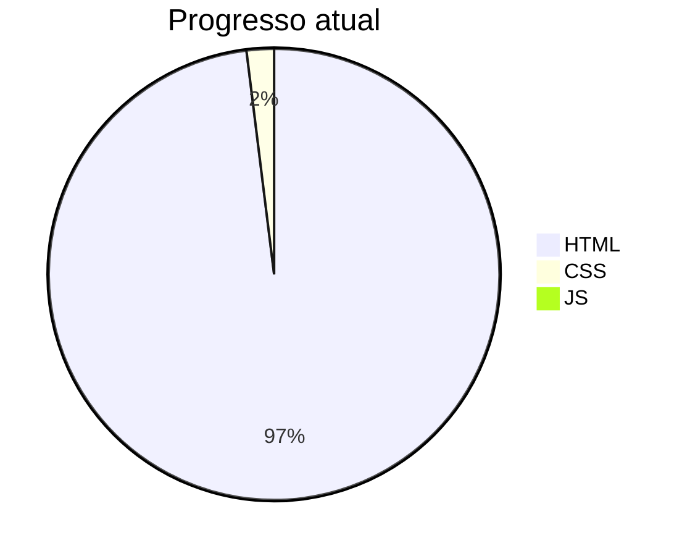

# SANTANDER 2025 FRONT-END - DIO (🚧 EM ANDAMENTO)

## 🎯 Objetivo

Documentar minha jornada de aprendizado no curso de Front-End da DIO, 
salvando todos os exercícios, anotações e projetos desenvolvidos durante as aulas.

## 📁 Estrutura

| Pastas    | Descrição                 | Status           |
|---------  |---------------------------|------------------|
| `HTML`    | Primeiros passos com HTML | ✅ Concluído     |
| `CSS`     | **Em contrução**          | 🟢 Em andamento  |
| `JS`      | **Em contrução**          | 🟢 Em andamento  |
| `Projects`| **Em contrução**          | 🟢 Em andamento  |

## 📊 Gráfico de Progresso

## 📈 Meu aprendizado

### 🏁 HTML (concluído)
- [x] Estrutura básica (DOCTYPE, html, head, body);
- [x] Títulos (h1 ao h6);
- [x] Parágrafos e formatação (p, strong, mark, u, sup, blockquote, i);
- [x] Listas (ul, ol, li);
- [x] Links (a href, target);
- [x] Inputs (text, email, password, number, button, range, color, url, date, week, month, checkbox, radio, hidden, file, search);
- [x] Estrutura do formulário;
- [x] Atributos: action, method, name;
- [x] GET vs POST;
- [x] Fieldset e legend;
- [x] Label;
- [x] Disabled;
- [x] Textarea (área de texto);
- [x] Botões de envio e limpar;
- [x] Estrutura do site (layout) e atributos;
- [x] Estilização inline (style no head);
- [x] Aplicação de eventos;
- [x] Tags de mídia (img, audio, video, iframe);
- [x] Tabelas e estruturação (thead, tbody, tfoot);
- [x] Acessibilidade (summary, title, alt);
- [x] Navegações;
- [x] Diferença entre as tags figure e picture;
- [x] Comentários no código;

### 🧠 JavaScript (em andamento)

- [x] Conceitos e funcionamento de Fluxograma;
- [x] Criação de variáveis;
- [x] Criando e manipulando vetores e matrizes;
- [x] Trabalhando com estruturas condicionais (if, else, else if);
- [x] Trabalhando com estruturas de decisão (for, while, do-while);
---

📅 **Última atualização:** 22/03/2026